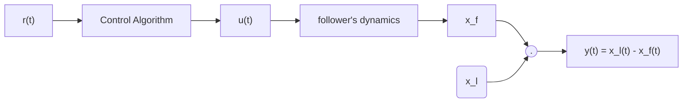
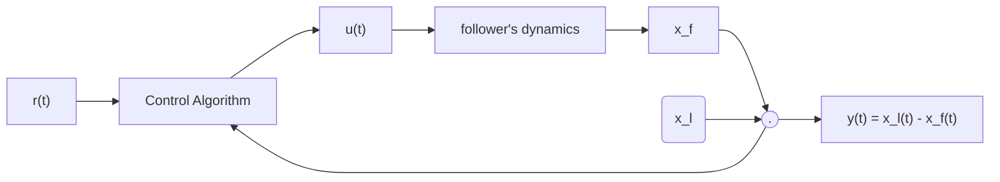
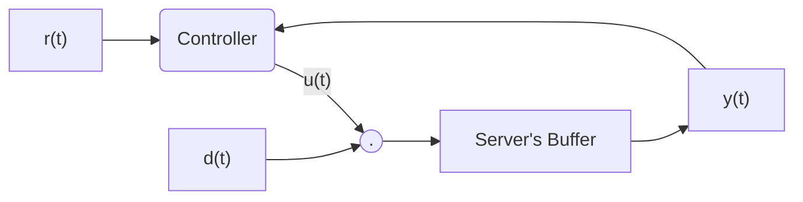
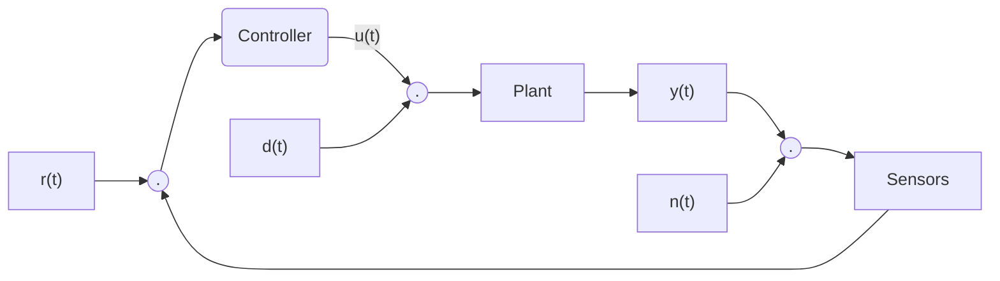
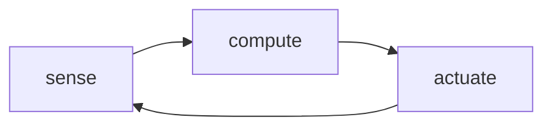

#SE 380

Feedback Control

## Day 1

### Example

> There are two cars on a linear track. There is a follower and a leader. There are the following constraints:

> * The distinace from the beginning of the track to the follower's center is $x_f$
> * The distinace from the beginning of the track to the leader's center is $x_l$

> * The distance between the follower and the leader is $x_l - x_f $
> * leader is driven by a human
> * follower is driven by a computer which is able to assign the velocity of the vehicle

> Objective: Write a program that decides the appropriate speed of the follower in order to maintain a given (safe) inter-vehicle disance

> Assumptions:
> 
>   * 1-d motion only
>   * $\frac{d x_f(t)}{dt} - u(t)$ where $u$ is the follower's velocity which we pick
>   * The leader's speed is unknown and beyond our control but they don't drive too wildly, ie $\frac{d x_l(t)}{dt} \approx C $ for some constant $C$

#### Option 1: Open-Loop

* don't equip the follower with sensors (save money!)
* algorithm to decide velocity only has access to the desired inter-vehicle (denoted by $r(t)$)

Control Diagram:

Problem:

* since the controller has no idea what $y(t)$ is, it cannot make a ood decision
* open-loop will not work well in practice

#### Option 2: Closed-Loop

* equip the follower with a stereo camera or LIDAR sensors to measure $y(t) = x_l(t) - x_f(t)$
* same control diagram as before bu thte control algo now receives $y(t)$

Control Diagram:

Now we choose a control algo!

##### Choice 1: simplest control algorithm is "on-off" control

$$
u(t) = 
\begin{cases}
    \bar{u},& r(t) - y(t) < 0 \\
    u, & r(t) - y(t) > 0
\end{cases}
$$

This algorithm has problems

1. $\bar{u}$ must be picked to be greater than the leader's velocity , same with $u$
2. the resulting motion is uncomfortable

##### Choice 2: proportional error feedback

We pick some $K_p$ such that $K_p > 0$ and have,

$$
u(t) = -K_p(r(t) - y(t))
$$
We'll learn that an even better controller is proportional-integral error feedback.

$$
u(t) = -K_p(r(t) - y(t)) - K_i \int_0^{t}r(\tau)-y(\tau) d\tau
$$

## Day 2

##### Example 1.4.1

> Consider a webserver that responds to queries from browsers
>
> - The server contains a buffer of incoming requests, so that if it's busy and a request comes then it doesn't loose track of the request
> - Let $a(t)$ be the total requests received at time $t$
> - Let $b(t)$be the total served requests at time $t$
> - Let $y(t)$ be the size of the buffer at time $t$
> - We then have $y(t) = a(t) - b(t)$
>
> Objective: Keep the buffer size $y(t)$ at a constant non-zero value $r(t)$
>
> - Constraint: the server's service rate is unknown as it depends on the number of clients. Therefore we model the service rate as an unknown disturbance
> - Control objective: decide on the request rate input $u(t)$ so that $y(t) \approx r(t)$

We then have $\frac{dy}{dt} = u(t) - d(t)$ for demand $d(t)$ in order for the buffer size to stay constant, since if $d(t) >> u(t)$ then the buffer will get very large and so we hope to increase $u(t)$ such that  the rate that the buffer is increasing, $\frac{dy}{dt}$, decreases.

Control engineering attempts to change the behaviour of a system (Plant) in a useful way despite the presence of external influences ("distrubances") and *model uncertainty*.

Signals

- $r(t)$: reference
- $y(t)$: plant output
- $u(t)$ controller output
- $a(t)$: distrubance
- $n(t)$: noise

Systems

- Controller
- Plant
- Sensors

Note: In the course, often we will be given the plant but we must decide on the sensors and controller!

Control Cycle:

The controllers we develop differ from traditional software because of the control role that *system dynamics* play and the real-time nature of implementation

##### 1.3 Control Engineering Design Cycle

1. Study the system that is to be controlled and then decide on sensors & actuators

   - e.g. camera or LIDAR, type of motor
2. Model the resulting system

   - a mathematical model

   - often one or more differential equations
     - e.g. follower in last day's example: $\frac{dx_f}{dr} = u(t)$
3. Simplify the model if necessary

   - classical control requires that the plant have a *transfer function*, ie it is LTI and is an input-output model
   - e.g. follower example: we take the Laplace transform of both sides
     - $L\{\frac{dx_f}{dr}\} = L\{u(t)\}$
     - $X_f(s)-x_f(0) =U(s)$
     - $X_f(s) = \frac{1}{s}U(s) + \frac{1}{s}x_f(0)$
     - The fraction $\frac{1}{s}$ in the term $\frac{1}{s}U(s)$ is the transfer function!
4. Analyze the model
5. Determine design specifications

   - Stability (the most important specification)
     - ex. The follower does not stop or keep accelerating as time goes on
   - Good steady-state behaviour
     - ex. The follower is the right distance away from the leader car
   - Robustness
     - ex. The system consistent with different parameters

   - Good transient behaviour
     - ex. We don't overshoot or undershoot too much, so as to make the acceleration pleasant
6. Decide on type of controller
7. Design the controller

   - In this course we will limit ourselves to LTI controllers, has a transfer function
   - e.g. the follower's P1 controller
     - $\frac{U(S)}{E(s)} = K_p + \frac{1}{s}K_i$
8. Simulate a closed-loop system

   - ex. use MATLAB to run the system and plot system variables, error, etc
9. Return to step 1 if necessary
10. Implement the controller on an actual system!

Note: we can build circuits that have the transfer function from step 7

- More realistically, the ODE from step 7 is approximated as a *difference equation* so as to perform computation over discretized time
- This approximation works well so long as the computer runs fast enough
  - Ex. the control system could have very fast dynamics which would require faster compute to run digitally

## Tutorial 1

##### Complex Numbers

A complex number is a pair of real numbers $a$ and $b$ put into the form $a +bj$ such that $j^2 = -1$.

Addition:
$$
a+bj + c + dj \\= (a+c) + (b+d)j \\
$$
Multiplication:
$$
(a+jb)(c+jd) \\ = ac + jbc +jad + bdj^2 \\ = (ac - bd) + (bc + ad)j
$$
We may also plot the complex numbers on a plane where $y = Im(a+jb)=b \and x = Re(a+jb)=a$

We denote the length as the *modulus*, ex. $|1+\sqrt{3}j|=\sqrt{(1)^2+(\sqrt{3})^2}$. We denote the angle as the *argument*, ex. $Arg(1+\sqrt{3}j)=\frac{\pi}{3}$. We denote this form as the *rectangular* or *cartesian* form. 

The *polar* form of a complex number is $re^{j\Theta}$ such that $r >0$ and $\Theta \in (-\pi, \pi ]$. Because of Euler's identity we have $e^{j\Theta} = cos\Theta + j sin\Theta$ with the following properties.

1. $|c| = r$
2. $Arg(c) = \Theta$

Ex. Compute $\frac{1}{(\frac{1}{\sqrt{2}}+j\frac{1}{\sqrt{2}})^4}$

$$
\frac{1}{(\frac{1}{\sqrt{2}}+j\frac{1}{\sqrt{2}})^4} \\
= \frac{1}{(e^{\frac{j\pi}{4}})^4} \\
= \frac{1}{e^{j\pi}} \\
= e^{-j\pi} \\
= -1
$$

##### Laplace Transforms

Recall: 

- say $f: R -> R, f \in O(s^{+})$

- Then the Laplace transform of $f$, denoted $F$, is $F(s) = \int_0^\infty f(\tau)e^{-st}d\tau$

- Eg: The Laplace transform of $f(t) = e^{3t}$ is $F(s) = \frac{1}{s-3}$

Recall:

- $L\{f+g\} = L\{f\} + L\{g\}$
- $L\{cf\} = cL\{f\}$

$$
y^{'} + 3y = 0 \\
sY(s) - y(0) + 3Y(1) = 0
$$

- Derivative Rule:

$$
L\{\frac{d^n}{dt^n}\} \\= s^nY(s)-s^{n-1}y(0)-s^{n-2}y^{'}(0)-s^{n-3}y^{''}(0)-...-1y^{n-1}(0)
$$

- Convolution: $L\{f*g\}=F(s)G(s)$

- Frequency Diff: $L\{e^{at}f(t)\}=F(s-a)$

Ex. Find the transfer function
$$
y^{''}(t)+y^{'}(t)=u(t) \\
y(0) = y^{'}(0)=0\\
s^2Y(s)+sY(s)=U(s) \\
Y(s)=\frac{1}{s^2+s}U(s)
$$
Here, $\frac{1}{s^2+s}$ is the transfer function since it multiples the input to get the output in the frequency domain!

##### Linear Algebra

Let $x=(x_1,x_2)^T \in R^2$ be a vector

$$
f(x) = \begin{bmatrix}3&1\\0&2\end{bmatrix}\begin{bmatrix}x_1 \\ x_2\end{bmatrix} \\
f(\begin{bmatrix}1\\1\end{bmatrix}) = \begin{bmatrix}3&1\\0&2\end{bmatrix}\begin{bmatrix}1 \\ 1\end{bmatrix} \\
f(\begin{bmatrix}1\\1\end{bmatrix}) = \begin{bmatrix}3(1)+1(1)\\0(1)+2(1)\end{bmatrix} \\
f(\begin{bmatrix}1\\1\end{bmatrix}) = \begin{bmatrix}4\\2\end{bmatrix}
$$

$$
\begin{bmatrix}3&1\\0&2\end{bmatrix}\begin{bmatrix}3&0&0 \\ 1&1&1\end{bmatrix} \\
= \begin{bmatrix}3(3)+1(1)&3(0)+1(1)&3(0)+1(1) \\ 0(3)+2(1)&0(0)+2(1)&0(0)+2(1)\end{bmatrix} \\
= \begin{bmatrix}10&1&1 \\ 2&2&2\end{bmatrix} \\
$$

Lets say that $\begin{bmatrix}y_1\\y_2\end{bmatrix}=\begin{bmatrix}a&b\\c&d\end{bmatrix}\begin{bmatrix}x_1\\x_2\end{bmatrix}$ and we know $y_1$ and $y_2$.

Eg:
$$
\begin{bmatrix}y_1\\y_2\end{bmatrix}=\begin{bmatrix}1&1\\0&1\end{bmatrix}\begin{bmatrix}x_1\\x_2\end{bmatrix}
$$
For a 2x2 matrix $M=\begin{bmatrix}a&b\\c&d\end{bmatrix}$ we define the determinant as $det(M) = ad-bc$. If $det(M) \neq 0, \exists M^{-1}, M^{-1}M = I$ then we have $M^{-1} = \frac{1}{det(M)}\begin{bmatrix}d&-b \\ -c&a \end{bmatrix}$

## Day 3

##### Mathematical Models of Systems

- A *model* is a set of equations that describe how a system transfers inputs to outputs
- No model is perfect!
- There is a compelxity trade-off between accuracy and complexity

