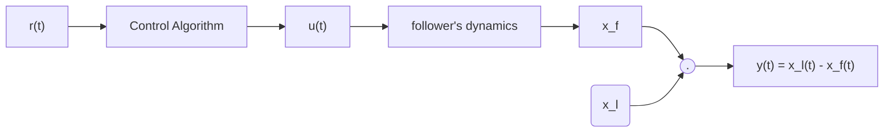
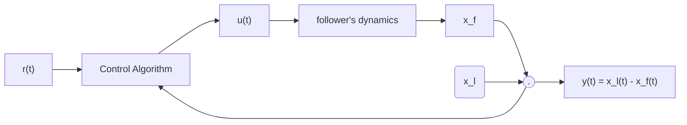

#SE 380

Feedback Control

## Day 1

### Example

> There are two cars on a linear track. There is a follower and a leader. There are the following constraints:

> * The distinace from the beginning of the track to the follower's center is $x_f$
> * The distinace from the beginning of the track to the leader's center is $x_l$

> * The distance between the follower and the leader is $x_l - x_f $
> * leader is driven by a human
> * follower is driven by a computer which is able to assign the velocity of the vehicle

> Objective: Write a program that decides the appropriate speed of the follower in order to maintain a given (safe) inter-vehicle disance

> Assumptions:
> 
>   * 1-d motion only
>   * $\frac{d x_f(t)}{dt} - u(t)$ where $u$ is the follower's velocity which we pick
>   * The leader's speed is unknown and beyond our control but they don't drive too wildly, ie $\frac{d x_l(t)}{dt} \approx C $ for some constant $C$

#### Option 1: Open-Loop

* don't equip the follower with sensors (save money!)
* algorithm to decide velocity only has access to the desired inter-vehicle (denoted by $r(t)$)

Control Diagram:

Problem:

* since the controller has no idea what $y(t)$ is, it cannot make a ood decision
* open-loop will not work well in practice

#### Option 2: Closed-Loop

* equip the follower with a stereo camera or LIDAR sensors to measure $y(t) = x_l(t) - x_f(t)$
* same control diagram as before bu thte control algo now receives $y(t)$

Control Diagram:

Now we choose a control algo!

##### Choice 1: simplest control algorithm is "on-off" control

$$
u(t) = 
\begin{cases}
    \bar{u},& r(t) - y(t) < 0 \\
    u, & r(t) - y(t) > 0
\end{cases}
$$

This algorithm has problems

1. $\bar{u}$ must be picked to be greater than the leader's velocity , same with $u$
2. the resulting motion is uncomfortable

##### Choice 2: proportional error feedback

We pick some $K_p$ such that $K_p > 0$ and have,

$$
u(t) = -K_p(r(t) - y(t))
$$
We'll learn that an even better controller is proportional-integral error feedback.

$$
u(t) = -K_p(r(t) - y(t)) - K_i \int_0^{t}r(\tau)-y(\tau) d\tau
$$